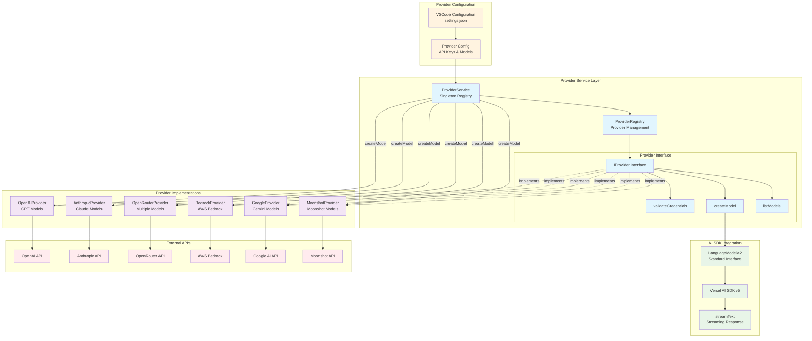
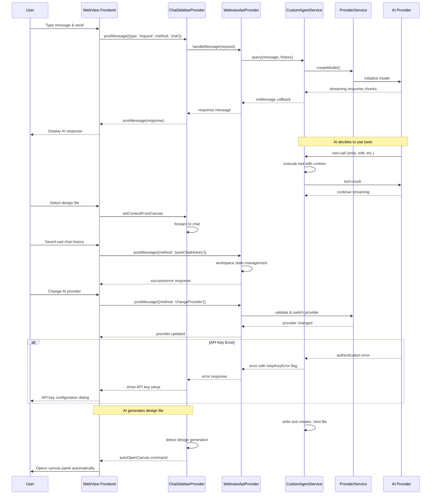

# 🧠 SecureDesign — AI Design Agent for Your IDE

## 🧐 How is SecureDesign different?

- 🔒 **Security First**: Does not publicly leak your prompts and mocks
- 🙈 **100% Private**: No email registration or data collection
- 🖥️ **Local / Offline Models**: First class support for LM Studio, Ollama, etc.
- ⛓️‍💥 **Fully OSS, no enterprise license**: SecureDesign will never use non-OSS code
- ↗️ **Up-to-date dependencies**: Always uses the latest AI and other libraries
- 🧑‍🧑‍🧒‍🧒 **Community Driven**: No business pressures, quickly merged PRs

## 🚀 Links

- 🪟 [VS Code Marketplace install](https://marketplace.visualstudio.com/items?itemName=HaroldMartin.securedesign)
- 💞 [Open VSX Registry install](https://open-vsx.org/extension/HaroldMartin/securedesign)
- ⚙️ [DeepWiki architecture description / diagrams](https://deepwiki.com/hbmartin/secure-design)

### **By:** [AI Jason](https://x.com/jasonzhou1993) & [JackJack](https://x.com/jackjack_eth)

SuperDesign is the first **open-source design agent** that lives right inside your IDE.  
Generate UI mockups, components, and wireframes directly from natural language prompts.  
Works seamlessly with Cursor, Windsurf, Claude Code, and plain VS Code.

> ✨ "Why design one option when you can explore ten?" — SuperDesign

---

## 🎬 Demo Video (Click to play)

---

## 🚀 Features

- 🖼️ **Product Mock**: Instantly generate full UI screens from a single prompt
- 🧩 **UI Components**: Create reusable components you can drop into your code
- 📝 **Wireframes**: Explore low-fidelity layouts for fast iteration
- 🔁 **Fork & Iterate**: Duplicate and evolve designs easily
- 📥 **Prompt-to-IDE**: Copy prompts into your favorite AI IDE (Cursor, Windsurf, Claude Code)

---

## 🛠️ Getting Started

1. **Install the Extension** from the Cursor/VS Code Marketplace
2. Open the `SecureDesign` sidebar panel
3. Type a prompt (e.g., _"Design a modern login screen"_)
4. View generated mockups, components, and wireframes
5. Fork, tweak, and paste into your project

---

## Can I use my own Claude Code or Cursor subscription?

Yes, after you initialise securedesign extension, some cursor/claude code rules will be added, so you can prompt the agent to do design and preview in securedesign canva (cmd + shift + p -> securedesign: open canva)

If using Cursor - I will highly suggest copy the prompt in 'design.mdc' and create a custom mode in cursor with that same system prompt; This should give you much better performance

## How to run local OpenAI compatible servers?

1. Select open ai on Ai Model Provider
2. Put anything in Openai Api Key input
3. Add your OpenAi Url on the Openai Url input (example: http://127.0.0.1:1234/v1 for LM Studio)

## 📂 Where Are My Designs Stored?

Your generated designs are saved locally inside `.superdesign/`.

## ❓ FAQ

**Is it free and open source?**  
Yes! We are open source — fork it, extend it, remix it.

**Can I customize the design agent?**  
Yes — use your own prompt templates, modify behaviors, or add commands.

**Can SuperDesign update existing UI?**  
Absolutely — select a component, describe the change, and let the agent do the rest.

## Architecture

SecureDesign follows a modular architecture with clear separation of concerns between the VS Code extension host, AI providers, and webview interfaces.

### Overall System Architecture

```mermaid
graph TB
    subgraph "VS Code Extension Host"
        EXT[Extension.ts<br/>Entry Point]
        SM[ServiceContainer<br/>Dependency Injection]

        subgraph "Services Layer"
            CAS[CustomAgentService<br/>AI Integration]
            MS[ChatMessageService<br/>Message Processing]
            WS[WorkspaceStateService<br/>State Management]
            FS[FileWatcherService<br/>File Monitoring]
            LOG[Logger<br/>Centralized Logging]
        end

        subgraph "Providers"
            CSP[ChatSidebarProvider<br/>Sidebar UI]
            WAP[WebviewApiProvider<br/>API Gateway]
            SCP[SuperdesignCanvasPanel<br/>Canvas UI]
        end

        subgraph "Tool System"
            RT[Read Tool]
            WT[Write Tool]
            ET[Edit Tool]
            BT[Bash Tool]
            GT[Grep Tool]
            GLT[Glob Tool]
            TT[Theme Tool]
        end
    end

    subgraph "AI Provider Layer"
        PS[ProviderService<br/>Provider Registry]

        subgraph "AI Providers"
            ANT[AnthropicProvider]
            OAI[OpenAIProvider]
            ORT[OpenRouterProvider]
            BED[BedrockProvider]
            GOO[GoogleProvider]
            MOO[MoonshotProvider]
        end
    end

    subgraph "WebView Frontend"
        CHAT[Chat Interface<br/>React Components]
        CANVAS[Canvas View<br/>Design Preview]
        COMP[UI Components<br/>Reusable Elements]
    end

    subgraph "File System"
        WF[Workspace Files]
        SD[.superdesign/<br/>Design Storage]
        CF[Config Files<br/>.cursor/rules, CLAUDE.md]
    end

    subgraph "External APIs"
        AIAPI[AI Model APIs<br/>OpenAI, Anthropic, etc.]
    end

    %% Connections
    EXT --> SM
    SM --> CAS
    SM --> MS
    SM --> WS
    SM --> CSP
    SM --> WAP
    SM --> SCP

    CAS --> PS
    PS --> ANT
    PS --> OAI
    PS --> ORT
    PS --> BED
    PS --> GOO
    PS --> MOO

    ANT --> AIAPI
    OAI --> AIAPI
    ORT --> AIAPI
    BED --> AIAPI
    GOO --> AIAPI
    MOO --> AIAPI

    CAS --> RT
    CAS --> WT
    CAS --> ET
    CAS --> BT
    CAS --> GT
    CAS --> GLT
    CAS --> TT

    RT --> WF
    WT --> WF
    ET --> WF
    BT --> WF

    CSP --> CHAT
    SCP --> CANVAS
    WAP --> COMP

    FS --> SD
    WS --> WF
    WS --> CF

    CHAT -.->|postMessage| CSP
    CANVAS -.->|postMessage| SCP
    CSP -.->|postMessage| CHAT
    SCP -.->|postMessage| CANVAS

    classDef service fill:#e1f5fe
    classDef provider fill:#f3e5f5
    classDef tool fill:#fff3e0
    classDef webview fill:#e8f5e8
    classDef external fill:#ffebee

    class CAS,MS,WS,FS,LOG service
    class CSP,WAP,SCP,PS provider
    class RT,WT,ET,BT,GT,GLT,TT tool
    class CHAT,CANVAS,COMP webview
    class AIAPI,ANT,OAI,ORT,BED,GOO,MOO external
```

### AI Provider System Architecture

### WebView IPC Communication Architecture

### Key Architectural Features

- **Modular Design**: Clear separation between extension host logic, AI providers, and UI components
- **Dependency Injection**: ServiceContainer manages service lifecycles and dependencies
- **Multi-Provider Support**: Pluggable AI provider system with unified interface
- **Tool System**: Secure file operation tools with workspace context
- **Streaming Communication**: Real-time AI responses via WebView message passing
- **Workspace Isolation**: Chat history and designs scoped per workspace
- **State Management**: Persistent state across VS Code sessions
- **Canvas Integration**: Automatic design preview and iteration workflow

## 👯 Contributors

