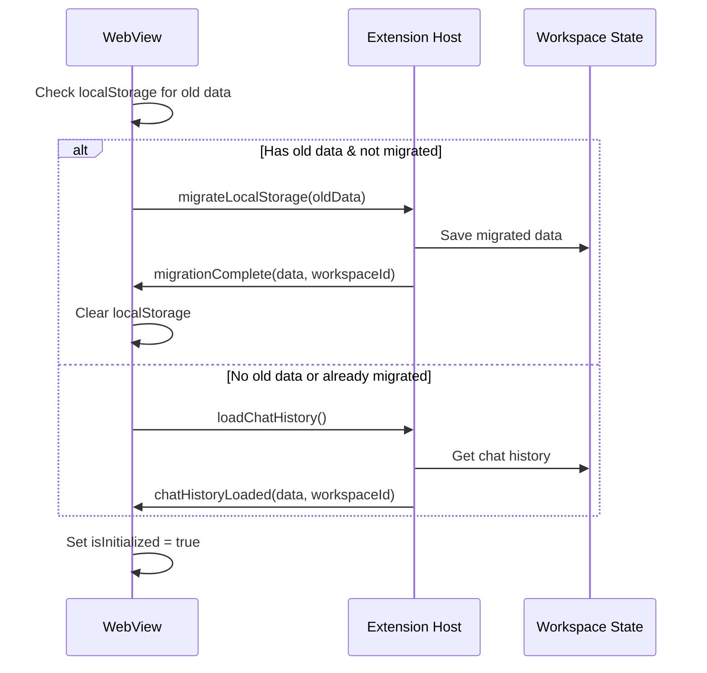
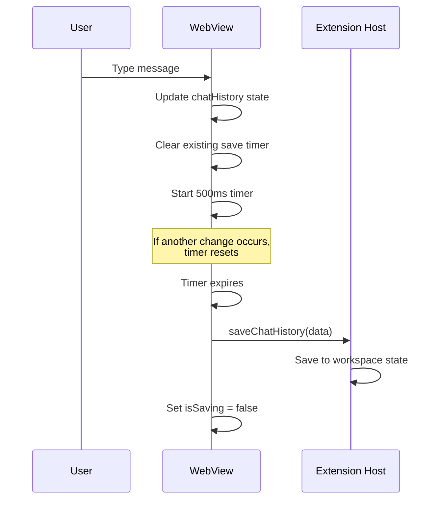
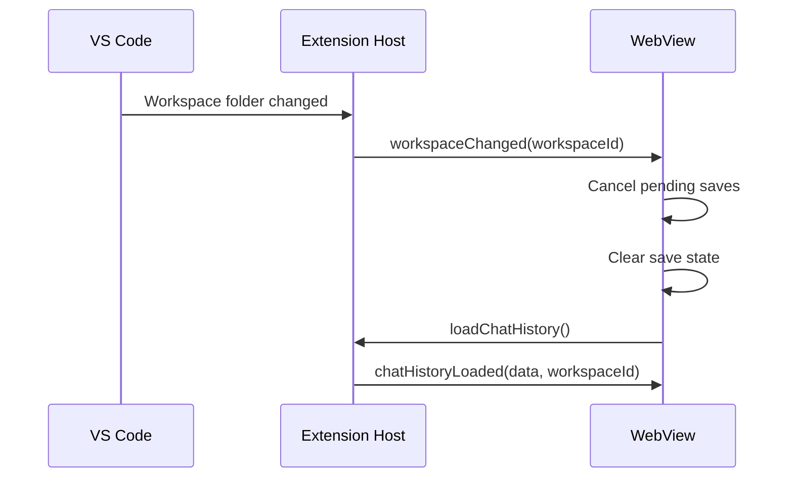
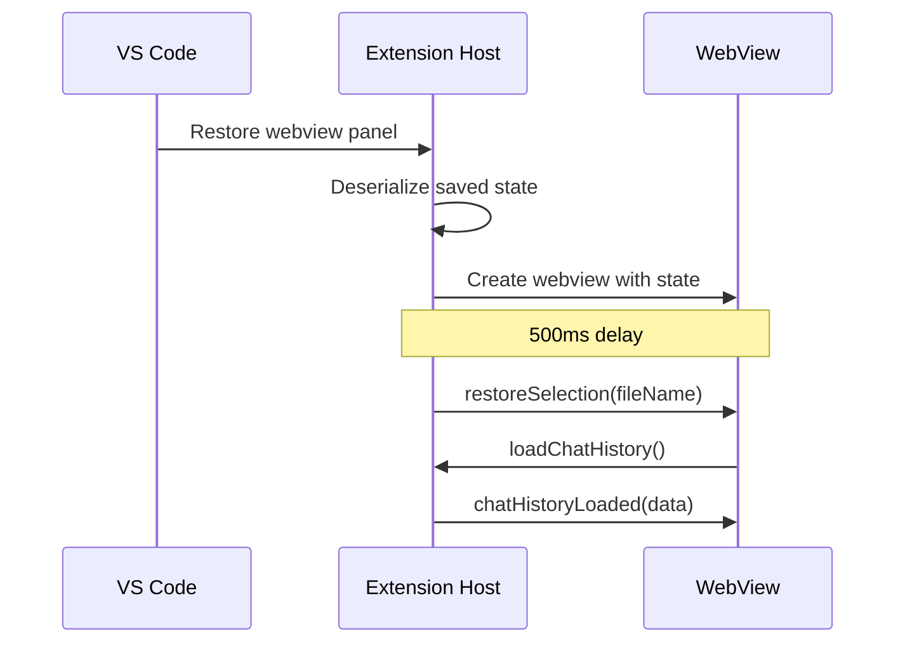

# WebView Message Contract Documentation

This document describes the message communication protocol between the VS Code extension host and webviews to ensure reliable, race-condition-free operations.

## Overview

The extension uses a bidirectional message passing system between:

- **Extension Host**: The main VS Code extension process
- **WebViews**: Chat sidebar and Canvas panel UI components

## Message Flow Guarantees

### 1. Initialization Sequence



**Race Condition Prevention:**

- `isInitialized` flag prevents duplicate initialization requests
- `hasMigrated` flag prevents duplicate migrations
- Migration only happens once per workspace (tracked in workspace state)

### 2. Chat History Save (Debounced)



**Race Condition Prevention:**

- 500ms debounce prevents rapid saves
- `isSaving` flag prevents loading during save
- Cancellation on workspace change

### 3. Workspace Changes



**Race Condition Prevention:**

- Cancels pending saves before switching
- Clears save state to prevent cross-workspace pollution
- New workspace ID prevents stale data

### 4. WebView Restoration



**Race Condition Prevention:**

- 500ms delay ensures webview is ready
- State passed through constructor
- Restoration happens after webview loads

## Message Types

### WebView → Extension

| Command                     | Purpose                   | Payload                                       | Response                      |
| --------------------------- | ------------------------- | --------------------------------------------- | ----------------------------- |
| `saveChatHistory`           | Persist chat to workspace | `chatHistory: ChatMessage[]`                  | None (fire-and-forget)        |
| `loadChatHistory`           | Request current chat      | None                                          | `chatHistoryLoaded`           |
| `clearWorkspaceChatHistory` | Clear all chat            | None                                          | `chatHistoryCleared`          |
| `migrateLocalStorage`       | Migrate old data          | `oldChatHistory: ChatMessage[]`               | `migrationComplete`           |
| `chatMessage`               | Send user message         | `message: string, chatHistory: ChatMessage[]` | Stream of `chatResponseChunk` |
| `stopChat`                  | Cancel streaming          | None                                          | `chatStopped`                 |

### Extension → WebView

| Command              | Purpose           | Payload                                            | Triggered By                |
| -------------------- | ----------------- | -------------------------------------------------- | --------------------------- |
| `chatHistoryLoaded`  | Provide chat data | `chatHistory: ChatMessage[], workspaceId?: string` | `loadChatHistory`           |
| `chatHistoryCleared` | Confirm clear     | None                                               | `clearWorkspaceChatHistory` |
| `migrationComplete`  | Migration done    | `chatHistory: ChatMessage[], workspaceId?: string` | `migrateLocalStorage`       |
| `workspaceChanged`   | Workspace switch  | `workspaceId?: string`                             | VS Code event               |
| `chatResponseChunk`  | Stream response   | Various                                            | `chatMessage`               |
| `chatError`          | Report error      | `error: string`                                    | Error condition             |

## Error Handling Strategy

### 1. Message Send Failures

```typescript
try {
    await webview.postMessage(message);
} catch (error) {
    Logger.error(`Failed to send message: ${error}`);
    // Graceful degradation - don't crash
}
```

### 2. Handler Errors

```typescript
try {
    await handleMessage(message);
} catch (error) {
    Logger.error(`Handler error: ${error}`);
    // Send error response if applicable
    webview.postMessage({
        command: 'error',
        error: error.message,
    });
}
```

### 3. Timeout Protection

- WebviewMessageGuard implements 5-second timeouts
- Pending requests cleaned up after 10 seconds
- Stale requests logged and rejected

## Best Practices

### DO:

✅ Always wrap handlers in try-catch  
✅ Use debouncing for frequent operations  
✅ Check webview disposal before sending  
✅ Log all message operations  
✅ Validate message payloads  
✅ Use type guards for message handling

### DON'T:

❌ Send messages in tight loops  
❌ Assume message delivery  
❌ Store state in both places  
❌ Send large payloads frequently  
❌ Ignore error responses  
❌ Mix sync and async patterns

## Testing Checklist

- [ ] Initialize fresh workspace
- [ ] Migrate from localStorage
- [ ] Switch between workspaces rapidly
- [ ] Save during workspace switch
- [ ] Restore after VS Code restart
- [ ] Handle network/API errors
- [ ] Clear chat during save
- [ ] Multiple panels open simultaneously
- [ ] Dispose during message send
- [ ] Large chat history (100+ messages)

## Debugging

Enable debug logging:

```typescript
Logger.debug(`Message sent: ${command}`);
Logger.debug(`Message received: ${command}`);
```

Monitor in VS Code Output panel:

1. Open Output panel (View → Output)
2. Select "SecureDesign" from dropdown
3. Watch for message flow

Common issues:

- "Cannot send message to disposed webview" - Check disposal guards
- "Timeout waiting for response" - Check handler implementation
- "Migration already performed" - Check migration flags
- "Chat history not loading" - Check workspace state initialization
